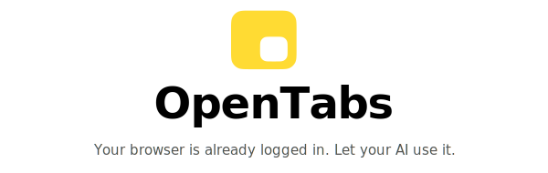

<div align="center">

<a href="https://opentabs.dev">
  <picture>
    <source media="(prefers-color-scheme: dark)" srcset="assets/readme-banner-dark.svg">
    <source media="(prefers-color-scheme: light)" srcset="assets/readme-banner-light.svg">
    
  </picture>
</a>

<br>

[Website](https://opentabs.dev) &nbsp;&middot;&nbsp; [Docs](https://opentabs.dev/docs) &nbsp;&middot;&nbsp; [Plugins](plugins/) &nbsp;&middot;&nbsp; [Discord](https://discord.gg/b8Hjpz4B)

<br>

[](https://www.npmjs.com/package/@opentabs-dev/cli)
[](LICENSE)
[](https://github.com/opentabs-dev/opentabs/stargazers)

</div>

---

**Browser automation clicks buttons. OpenTabs calls APIs.**

Your AI calls the same internal APIs the web app's own frontend calls, through your browser, using your existing session. No screenshots, no DOM scraping — just real API calls exposed as [MCP](https://modelcontextprotocol.io/) tools.

<figure>
  
  <figcaption><p align="center"><sub>AI sending a Discord message and adding reactions — real API calls, not browser automation</sub></p></figcaption>
</figure>

---

## Quick Start

You need [Node.js](https://nodejs.org/) 22+ and Chrome.

```bash
npm install -g @opentabs-dev/cli
opentabs start
```

First run prints config blocks for [Claude Code](https://github.com/anthropics/claude-code), Cursor, or Windsurf. Load the extension from `~/.opentabs/extension` in `chrome://extensions/` (Developer mode → Load unpacked).

```bash
opentabs plugin install <plugin-name>
```

See the [Quick Start guide](https://opentabs.dev/docs/quick-start) for a full walkthrough.

## Plugins

100+ plugins, ~2,000 tools — Slack, Discord, GitHub, Jira, Notion, Figma, AWS, Stripe, and [a lot more](plugins/). Install with a single command, use immediately.

Built-in browser tools (screenshots, clicking, typing, network capture) work on any tab without a plugin.

<figure>
  
  <figcaption><p align="center"><sub>Install a plugin, and the AI can use it immediately — no restart needed</sub></p></figcaption>
</figure>

## Build a Plugin

```bash
opentabs plugin create my-app --domain example.com
cd my-app && npm install && npm run build
```

Publish to npm and anyone can `opentabs plugin install` it. Or point your AI at any website — it can analyze the page, discover the APIs, and scaffold the plugin for you. See the [Plugin Development guide](https://opentabs.dev/docs/guides/plugin-development).

## Security

- **Everything starts off.** Every plugin is disabled by default — no tool executes until you explicitly enable it.
- **Code review built in.** Your AI reviews the plugin source before you enable it.
- **Version-aware.** When a plugin updates, permissions reset automatically.
- **Three permission levels.** Off, Ask (confirmation dialog), or Auto — per-plugin or per-tool.
- **Runs locally.** No cloud. Everything in `~/.opentabs/`. Full audit log. Anonymous [telemetry](https://opentabs.dev/docs/reference/telemetry) (opt-out).

---

## Contributing

```bash
git clone https://github.com/opentabs-dev/opentabs.git
cd opentabs && npm install && npm run build
npm run dev       # tsc watch + MCP server + extension
npm run check     # build + type-check + lint + knip + test
```

See the [Development Setup guide](https://opentabs.dev/docs/contributing/dev-setup). Questions? Join the [Discord](https://discord.gg/b8Hjpz4B).

## How This Was Built

Built entirely by AI agents — zero hand-written application code. Hundreds of PRDs executed by [Claude Code](https://github.com/anthropics/claude-code) workers via [Ralph](https://github.com/snarktank/ralph). Every PRD is open-sourced: **[opentabs-dev/opentabs-prds](https://github.com/opentabs-dev/opentabs-prds)**.

## License

[MIT](LICENSE) — Not affiliated with or endorsed by any third-party service. See the [full disclaimer](https://opentabs.dev/docs/legal/disclaimer).

---

**[Docs](https://opentabs.dev/docs)** &nbsp;&middot;&nbsp; [Quick Start](https://opentabs.dev/docs/quick-start) &nbsp;&middot;&nbsp; [Plugin Development](https://opentabs.dev/docs/guides/plugin-development) &nbsp;&middot;&nbsp; [SDK Reference](https://opentabs.dev/docs/sdk/plugin-class) &nbsp;&middot;&nbsp; [Browser Tools](https://opentabs.dev/docs/reference/browser-tools) &nbsp;&middot;&nbsp; [CLI Reference](https://opentabs.dev/docs/reference/cli) &nbsp;&middot;&nbsp; [Architecture](https://opentabs.dev/docs/contributing/architecture)

<p align="center"><sub>Built with <a href="https://github.com/anthropics/claude-code">Claude Code</a>, <a href="https://github.com/anomalyco/opencode">OpenCode</a>, <a href="https://github.com/snarktank/ralph">Ralph</a>, and <a href="https://github.com/Logging-Studio/RetroUI">RetroUI</a>.</sub></p>
